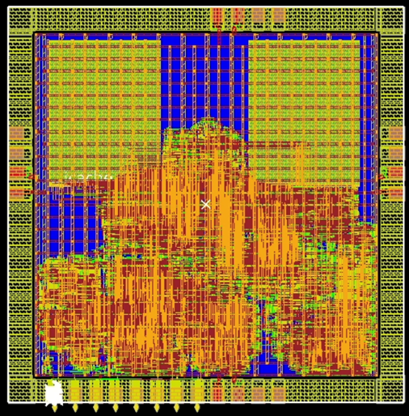
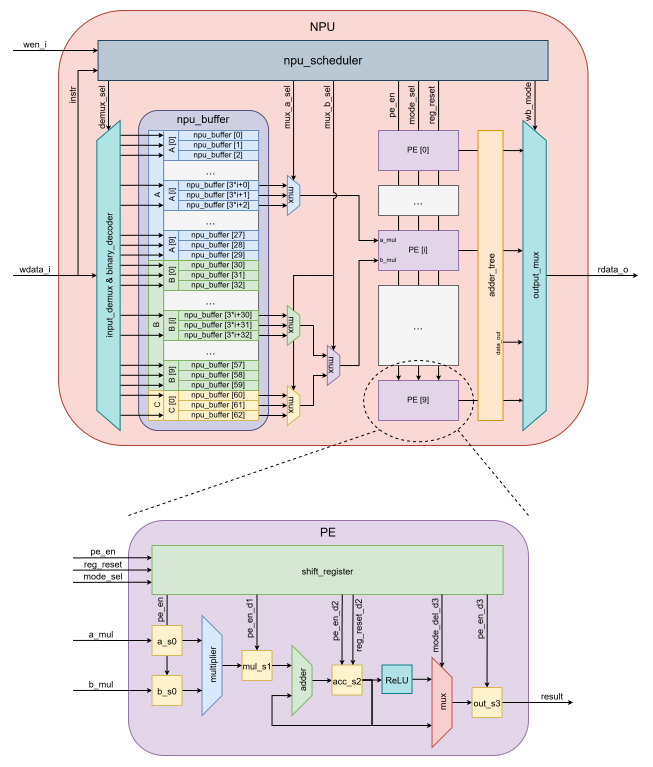

# CSCD
CNN System Chip Design (RTL and Testbench Components)

Feishu Documentation: https://bcncr0uo1h2n.feishu.cn/wiki/Fgt2wYKJciuy69ksGFvc6SXSnoa?from=from_copylink  

## Simulation Instructions
Execute commands from the project root directory. Use the file list located at `rtl/filelist.f`. The module specified after `TOP` is the top-level module from the source file list (currently `cv32e40p_xilinx_tb` defined in `rtl/cv32e40p/fpga/tb/cv32e40p_xilinx_tb.sv`). The bus interface module can be modified at `rtl/cv32e40p/fpga/rtl/src/cv32e40p_xilinx.sv`.

Simulations are performed using Synopsys VCS. Results are generated in `sim/build`:
```bash
make vcs
```

To simulate and open waveform visualization (Verdi), which loads the FSDB file generated by VCS. Verdi requires the source file list for contextual indexing. Waveform configurations can be maintained in `sim/signal.rc`:
```bash
make verdi
```

## Project Structure
- **PE directory**: Contains NPU design source code. The `rtl` subdirectory houses the course platform's reference framework.
  - `cv32e40p`: Platform-provided CPU core, AXI bus infrastructure, and simulation top-level module. Our design extends this foundation.
  - `RA1SHD_2048x32M8`: Platform-provided 8KB SRAM macro.
- **sim directory**: Contains simulation scripts and Makefiles. Simulation artifacts are generated in the `build` subdirectory.
- **pianlai_opensource directory**: Implements the low-level CNN inference operations. Compiled to machine code using the `riscv-gnu-toolchain`.

## Design Profile

|  |  |
|:-----------------------------------:|:------------------------------------------:|
|             Chip Layout             |              NPU Architecture              |
