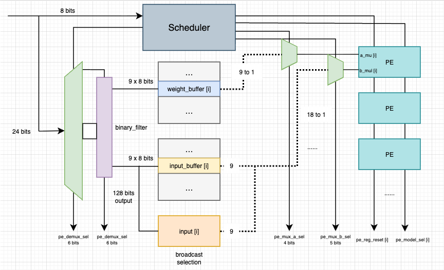
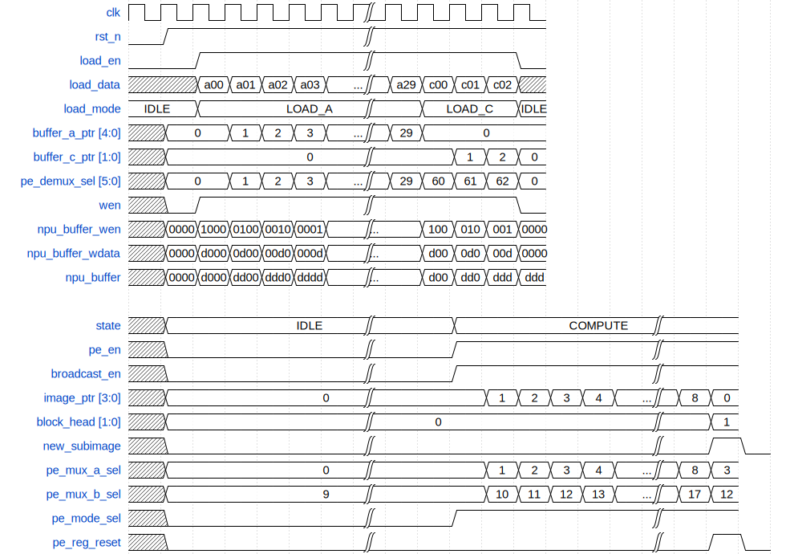

# 状态机总结

1. `pe_reg_reset`：9次一更新。
2. `pe_mode_sel`：基本都是全选，至少在第一层convolution中如此。
3. `pe_mux_a_sel`：涉及到如何算卷积的方式，以及如何复用数据。
   1. 设计指针：byte_ptr，当前需要取的数据的相对位置（0-8循环）。block_head当前正在计算的数据块的头位置（0->3->6->0-> ...循环。真正需要存数据块中取的相对位置为(block_head+byte_ptr) 溢出自动截取，最大$\leq 8$in_ptr，当前需要存的数据块的相对位置（0-2循环）。
4. `pe_en`：控制PE单元的启动与否。
5. `pe_mux_b_sel`：与`pe_mux_a_sel`类似，但需要决定是否将input广播。

# 波形图

<!-- 绘制代码如下 https://wavedrom.com/
  {signal: [
  {name: 'clk', wave: 'p......|.....'},
  {name: 'rst_n', wave: '01.....|.....'},
  {name: 'load_en', wave: '0.1....|....0'},
  {name: 'load_data', wave: 'x.22222|2222x', data: ['a00', 'a01', 'a02', 'a03', '...', 'a29', 'c00', 'c01', 'c02']},
  {name: 'load_mode', wave: '2.2....|.2..2', data: ['IDLE', 'LOAD_A', 'LOAD_C', 'IDLE']},
  {name: 'buffer_a_ptr [4:0]', wave: 'x2.2222|22...', data: ['0', '1', '2', '3', '...', '29', '0']},
  {name: 'buffer_c_ptr [1:0]', wave: 'x2.....|..222', data: ['0', '1', '2', '0']},
  {name: 'pe_demux_sel [5:0]', wave: 'x2.2222|22222', data: ['0', '1', '2', '3', '...', '29', '60', '61', '62', '0']},
  {name: 'wen', wave: 'x01....|....0'},
  {name: 'npu_buffer_wen', wave: 'x222222|.2222', data: ['0000', '1000', '0100', '0010', '0001', '...', '100', '010', '001', '0000']},
  {name: 'npu_buffer_wdata', wave: 'x222222|.2222', data: ['0000', 'd000', '0d00', '00d0', '000d', '...', 'd00', '0d0', '00d', '0000']},
  {name: 'npu_buffer', wave: 'x222222|.2222', data:['0000','d000', 'dd00', 'ddd0', 'dddd', '...', 'd00', 'dd0', 'ddd', 'ddd']},
  {},
  {name: 'state', wave: 'x2.....|..2.....|..', data:['IDLE', 'COMPUTE']},
  {name: 'pe_en', wave: 'x0.....|..1.....|..'},
  {name: 'broadcast_en', wave: 'x0.....|..1.....|..'},
  {name: 'image_ptr [3:0]', wave: 'x2.....|...22222|22', data:['0', '1', '2', '3', '4', '...', '8', '0']},
  {name: 'block_head [1:0]', wave: 'x2.....|........|.2', data:['0', '1']},
  {name: 'new_subimage', wave: 'x0.....|........|.10'},
  {name: 'pe_mux_a_sel', wave: 'x2.....|...22222|22', data:['0', '1', '2', '3', '4', '...', '8', '3']},
  {name: 'pe_mux_b_sel', wave: 'x2.....|...22222|22', data:['9', '10', '11', '12', '13', '...', '17', '12']},
  {name: 'pe_mode_sel', wave: 'x0.....|..1.....|..'},
  {name: 'pe_reg_reset', wave: 'x0.....|........|.10'}
]} -->